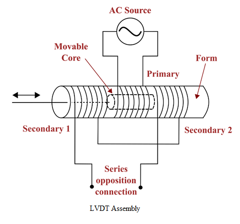
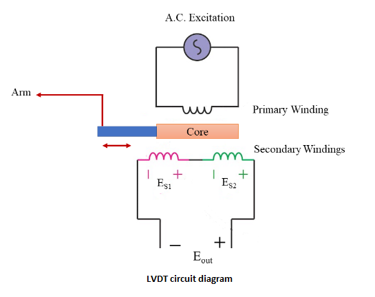

### Procedure

            

**Steps to perform the simuation**

# **Procedure**

In this experiment the maximum displacement that can be measured and given to LVDT core is : ±10 mm. i.e. 10 mm to the right or to the left from the mean position. Mean position is 10 mm.

1. Switch ON the LVDT trainer by clicking on green 'Power' button.

2. Make micrometer to read 10 mm i.e. rotate thimble till 0 of the circular scale coincides with 10 of main scale. This can be done by clicking on plus sign on 'Rotate Gauge' button. (Ex:- for positive core displacement or to move the LVDT core towards left side click on plus sign on 'Rotate Gauge' button and similerly to move the core to right side click on minus sign on 'Rotate Gauge' button.)

3. Display (Displacement (mm) box in trainer) will indicate 0. This is the position when core is at centre i.e equal flux linking to both the secondary.

4. Click on 'Table' at the bottom of the page to see the observation table and click on 'Add to Table' button to fill the observation table. 

5. Again click on plus sign of 'Rotate Gauge' button to display 2 mm displacement and repeat step 3 each time after +2 mm displacement change . Continue untill display indicates +10 mm. After taking observation of +10 mm displacement, come back to the mean position again (displacement in micrometer 10 mm or display will show 0 mm) by clicking on minus sign on 'Rotate Gauge' button. Click on 'Add to Table' button again to tabulate this 0 mm displacement.

6. Now click on minus sign on 'Rotate Gauge' button to display -2 mm displacement, click on 'Add to Table' button to tabulate the data. Repeat step 3 each time after -2 mm displacement change . Continue untill
display indicates -10 mm.

7. Click on 'Plot' button. The 'Output Voltage (|E0|) vs. Core displacement (mm)' plot will be shown. Hover the cursor on the plot, one camera icon will be visible in the top right corner above the plot section. Click on that camera icon to download the plot.

8. Switch off the trainer. Click on 'Clear' button to erase the observation data and plot. Click on 'Table' button to hide the observation table. 

            

