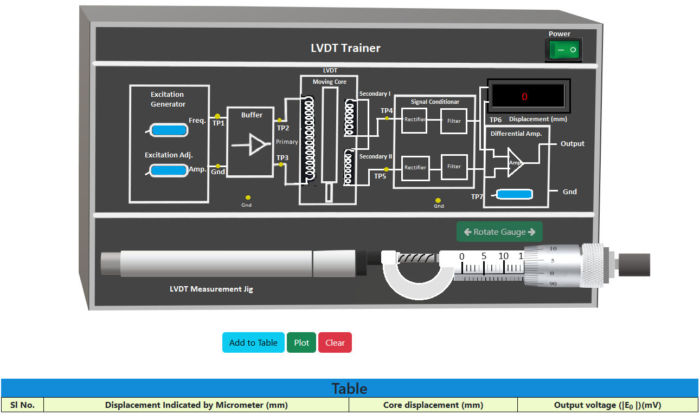

## Procedure

**Steps to perform the simuation**

In this experiment, the maximum displacement that can be applied to the LVDT core is ±10 mm, i.e., the core can move 10 mm to the right or 10 mm to the left from the mean (central) position. The mean position corresponds to 10 mm on the micrometer scale. Fig. 1 illustrates simulation interface for the displacement measurement by LVDT. To follow the instructions on the simulation page, please click on the blue ‘Instructions’ tab.

<b>Fig. 1. Simulation interface for the displacement measurement by LVDT</b>

<ol>
<li> Power ON the LVDT by clicking the green 'Power' button.</li> 

<li> Set the micrometer to 10 mm (mean position). Rotate the thimble until the ‘0’ mark on the circular scale coincides with the ‘10 mm’ mark on the main scale. This can be done by clicking the left arrow sign on the 'Rotate Gauge' button.</li>  

<li> For positive core displacement (movement towards the left), click the left arrow sign on 'Rotate Gauge'.</li> 

<li> For negative core displacement (movement towards the right), click the right arrow sign on 'Rotate Gauge'.</li> 

<li> The Displacement (mm) display on the trainer will now read 0, indicating that the core is at its central position, where equal magnetic flux links both secondary coils.</li> 

<li> Click on the 'Table' button at the bottom of the page to view the observation table, then click 'Add to Table' to record the reading.</li> 

<li> Click the left arrow sign on 'Rotate Gauge' to move the core in +2 mm increments. After each +2 mm movement, note the displayed displacement and click 'Add to Table' to record the value. Continue this process until the display shows +10 mm.</li> 

<li> After reaching +10 mm, return the micrometer to the mean position (10 mm) by clicking the right arrow sign on 'Rotate Gauge'. When the display again shows 0 mm, click 'Add to Table' to record this value.</li> 

<li> Now move the core in the negative direction by clicking the right arrow sign on 'Rotate Gauge' to obtain –2 mm displacement. Record the reading by clicking 'Add to Table'. Continue the same steps in –2 mm intervals until the display reaches –10 mm.</li> 

<li> Once all readings are recorded, click the 'Plot' button. The graph 'Output Voltage (|E₀|) vs. Core Displacement (mm)' will be displayed. Hover the cursor over the plot; a camera icon will appear in the top-right corner. Click it to download the plot.</li> 

<li> To reset, click the 'Clear' button to erase all data and the plot. Click 'Table' again to hide the observation table.</li> 
</ol>

      
                            
         
