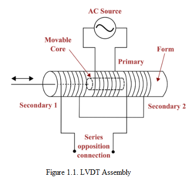
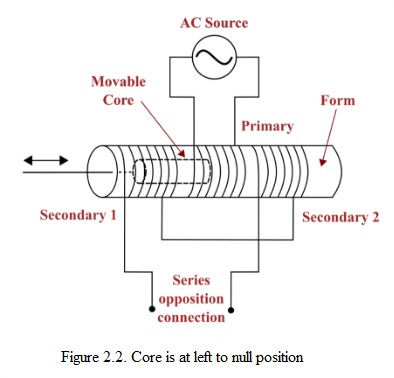
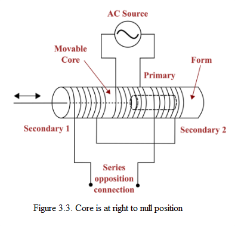

## Theory

 Displacement measurement is an essential aspect of many engineering and scientific applications. A common type of transducer that is utilized for the measurement of linear displacement is known as the linear variable displacement transformer (LVDT). The LVDT, is a passive inductive device that transforms linear displacement into an electrical signal. The LVDT has a primary coil, as well as two secondary coils, all wound on a cylindrical bobbin as shown in Fig. 1. Because the LVDT's soft iron core can slide inside the hollow transformer, it has the ability to affect the magnetic coupling between the primary and the two secondaries. The primary coil receives its energy from a voltage that is comprised of alternating current (AC). The primary coil is in the center, and on either side of it are two coils known as secondary coils. These secondary coils are not connected to any electrical circuit. The displacement that needs to be measured is applied at the arm that is attached to the core made of soft iron. When the core is in the center position, the magnetic fields of the primary and secondary coils are equal and opposite. As a result, there is no voltage induced in the secondary coils when the core is in this position. When the core is moved from its central position, the magnetic fields of the primary and secondary coils are disrupted so that they are no longer equal and opposite to one another. This causes a voltage to be induced in the secondary coils. The LVDT has an output voltage that is proportional to the amount of core displacement it measures

            

The core's position relative to the windings affects the magnetic coupling and, consequently, the induced electromotive force (e.m.f) in the windings.

In Case-1, when the core of the LVDT is at the null location, it means that the core is positioned such that it is equidistant from both secondary windings. In this scenario, the magnetic flux linking with both the minor windings (S1 and S2) is equal. As a result, the induced e.m.f in both windings will also be equal. Since the output voltage (Eout) is the difference between the voltages induced in the two secondary windings, and both S1 and S2 are equivalent, the output voltage will be zero. This indicates that no displacement or dislocation has occurred.

Eo = ES1– ES2 = 0 V

In Case-2, when the core of the LVDT is shifted towards the null point, the magnetic flux linking with the S1 winding becomes greater compared to the flux linking with the S2 winding. This asymmetry in the magnetic coupling leads to a higher induced e.m.f in winding S1  compared to winding S2. As a result, the output voltage (Eo) will be positive, indicating a positive displacement or shift from the null point.

Eo = ES1 - ES2 

            

In Case-3, when the core of the LVDT is shifted away from the null point in the opposite direction, the magnetic flux linking with the S2 winding becomes greater compared to the flux linking with the S1 winding. This results in a higher induced e.m.f in winding S2 compared to winding S1. Consequently, the output voltage (Eo) will be negative, indicating a negative displacement or shift from the null point.

Eo = ES1 - ES2  

            

				

						
								