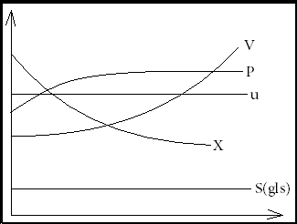
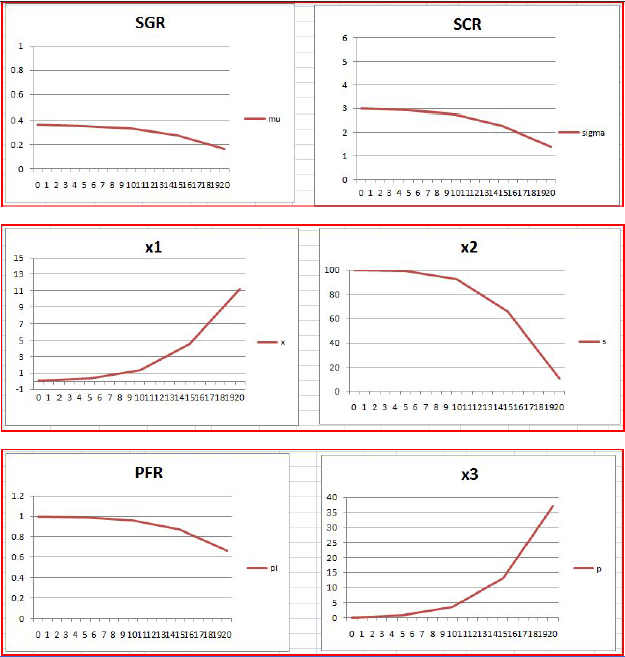

## Introduction

                            
                            
Chemical bioreactors are used to produce large quantities of important biological compounds like amino acids, recombinant proteins, antibiotics and viral vaccines. To achieve the full potential of biotechnological production methods a detailed description of the complex mechanism underlying cell growth and product formation is required. In this regard fed-batch reactors are important bio-reactors which come in between batch and continuous reactors. With the required knowledge of micro-organisms involved the nutritional environment can be maintained almost constant during the course of the fed-batch operation by introducing feed with required nutrients for growth and maintenance of bio-cells involved in the process. Since there is only inflow but no outflow the volume of the bioreactor increases continuously. While designing the reactor it is generally assumed that the growth of micro-organisms is limited by the concentration of one substrate. In a simple fed-batch required there are essentially two important components apart from the product- biomass and substrate. The substrate is the feed source for the cells which take the necessary nutrients required for their growth and convert them into biomass. A typical growth process involves the following stages:

                            
                            
(1) lag phase,  
(2) exponential growth phase  
(3) deceleration phase  
(4) stationary phase and lastly  
(5) death phase.
 

                            
Lag Phase

                            
The lag phase is a period of adaptation of the cells to the new environment. Depending on the composition of the nutrients some new enzymes essential for intracellular mechanisms are synthesized. However if the concentration of nutrients is low then it may result in a longer lag phase. To minimize the lag phase duration cells should be young and active and the inoculums size should be large. Also the nutrient medium can be optimised to contain certain growth factors required for minimising the lag phase.

                             
Exponential Growth Phase

                            
After the adaptation phase gets over the cells multiply rapidly as a result of which the cell mass and number density also increase exponentially. All the components generally grow at the same rate and thus the average composition remains approximately constant during this phase of the growth. Also if the nutrient concentrations are large the growth rate becomes independent of nutrient concentration.

                            

                                Declaration growth phase
                            

                            
                            
If there comes a point when there has been substantial depletion of one or more essential nutrients or accumulation of toxic by-products the growth rate decelerates. Also the rapidly changing environment causes unbalanced growth.

                            
Stationary Phase

                            
In this phase the net growth rate becomes zero. This happens not because no new cells are formed but because the growth rate becomes equal to the death rate. Cells though are still active and produce secondary metabolites (non-growth related products).

                            
Death Phase

                            
The death phase begins when there is substantial toxic product accumulation or complete nutrient depletion. In such circumstances, dead cells lyse (destruction of cell membrane) and intracellular proteins are released into the medium only to be used by other active cells.

                            
The microbial products can be essentially classified into three major categories: 

              1. Growth associated products- These are those products formed simultaneously with microbial growth. The specific rate of product formation is proportional to the specific rate of growth. Example: production of constitutive enzyme.

               2. Mixed growth associated products- Here products are formed during the slow growth and stationary phases. Example: Production of lactic acid fermentation.

             3. Non-growth associated products- Products are formed during the stationary phase when the net growth rate is zero. The specific rate of product formation is constant. Example: Secondary metabolites like antibiotics (penicillin).

                            

                                </img>
                                 
                                Time profiles for a fed-batch culture for a process involving growth associated production. V=volume of the fermentor, P=product concentration, u=specific growth rate, X=biomass and S(gls) = growth limiting substrate concentration.
                            

                            
Model Eqations used for simulation

                            

                                The model equations used for simulation are based on fed-batch biochemical reactions growing baker's yeast. It is assumed that the feed does not contain any product. The differential equations are as follows:
                                 
                                `(dx_1)/dt=mux_1-F/Vx_1`  `(dx_2)/dt=-sigmax_1+F/V(x_2f-x_2)`  `(dx_3)/dt=prodx_1-F/Vx_3`  `(dV)/dt=F`  `mu=(0.408x_2)/(0.22+x_2)e^(0.028x_3)`  `sigma=mu/0.1`  `prod=x_2/(0.44+x_2)e^(-0.015x_3)`  Here,  
x1 represents the cell mass concentration(g/l), 
x2 the substrate concentration(g/l),  
x3 the desired product concentration(g/l),  
F the feed rate(l/hr), 
V the volume of the broth(l), 
μ is the specific growth rate (SGR)(`hr^-1`),  
σ is the substrate consumption rate (SCR)(`hr^-1`), and  
π is the product formation rate (PFR) (`hr^-1`).
                            

                           
Concentration and rate profiles in fed-batch reactor

                            

                        

     
 