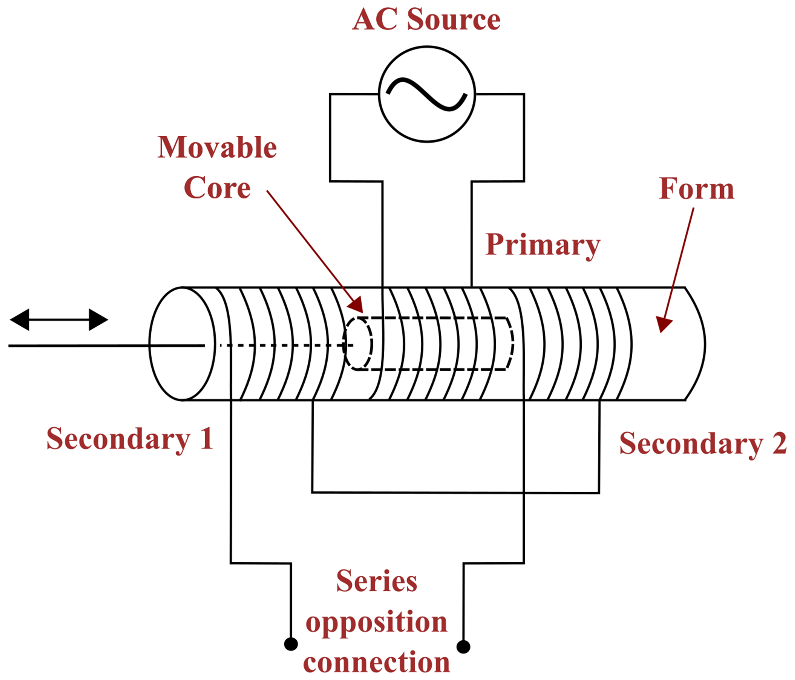
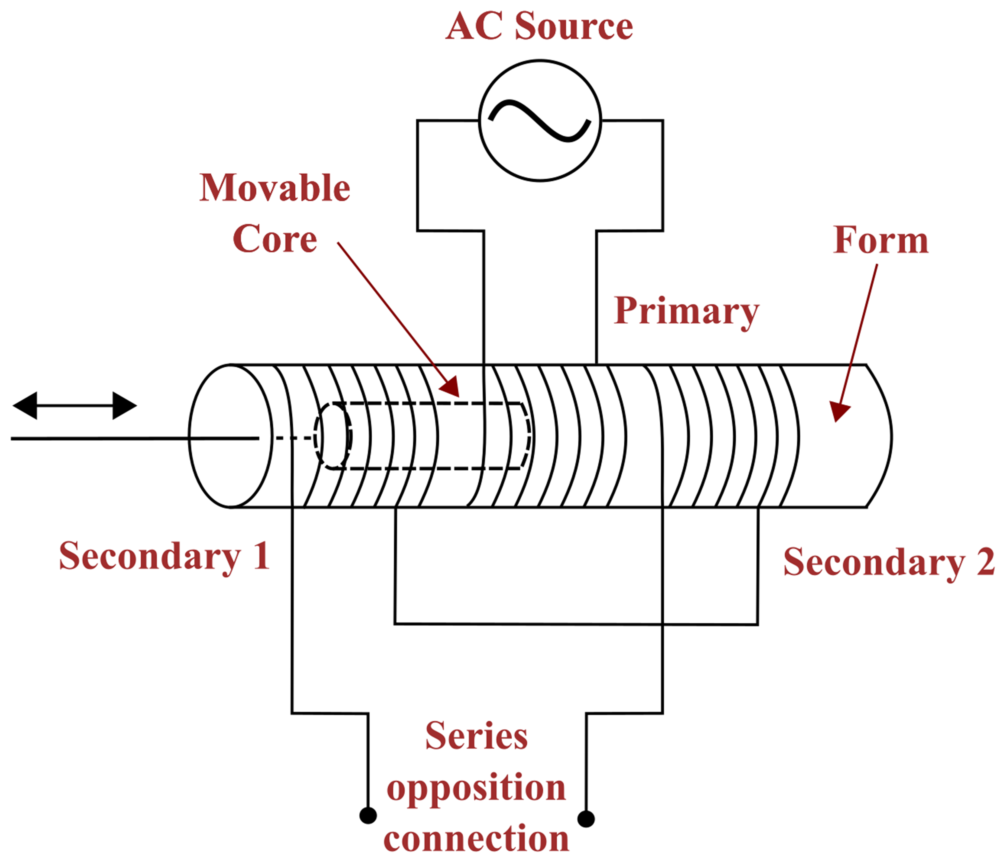
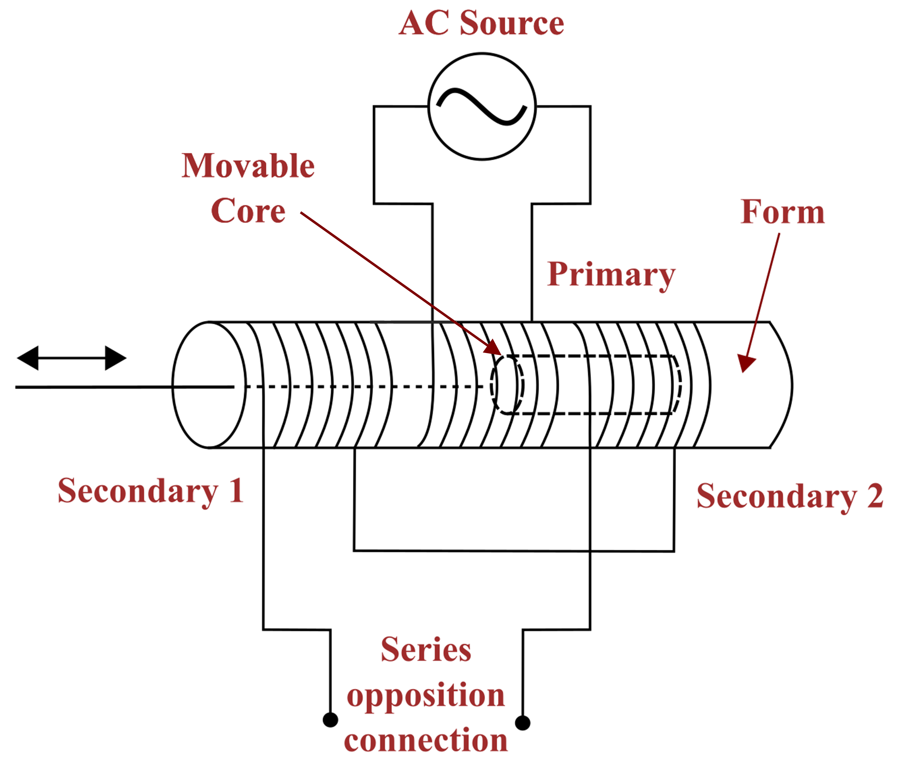
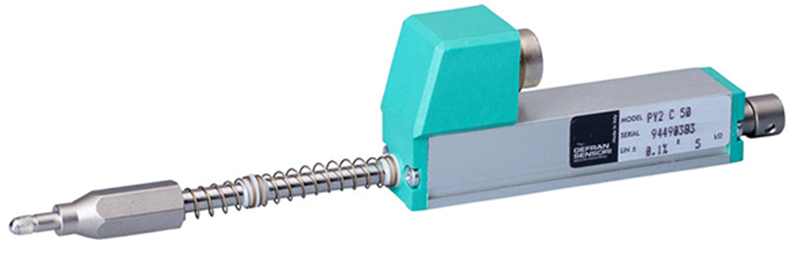

## Theory

 Displacement measurement plays a vital role in numerous engineering and scientific applications. One of the most widely employed transducers for measuring linear displacement is the Linear Variable Differential Transformer (LVDT). The LVDT is a passive inductive transducer that converts linear mechanical displacement into a corresponding electrical signal. Structurally, it consists of a primary coil and two secondary coils wound on a cylindrical hollow form, as illustrated in Fig. 1. A soft iron core, capable of moving freely within the hollow form alters the magnetic coupling between the primary and secondary windings. An alternating current (AC) excitation voltage is applied to the primary coil, which is centrally positioned between the two secondary coils. The secondary coils are connected in such a way that their induced voltages are in opposition (series opposition). The displacement to be measured is transmitted to the movable soft iron core through an attached mechanical arm. When the core is in its null or central position, the magnetic flux linking the two secondary coils is equal and opposite, resulting in zero net output voltage. However, when the core is displaced from the central position, the magnetic coupling becomes unbalanced, causing a differential voltage to be induced in the secondary coils. The magnitude of this output voltage is directly proportional to the extent of core displacement, while its phase (polarity) indicates the direction of movement. Thus, the LVDT provides a highly sensitive, accurate, and continuous electrical representation of linear displacement, with the core’s position determining the induced electromotive force (e.m.f.) in the secondary windings. Fig. 4 shows the image of a real LVDT.

 

<b>Fig. 1. LVDT Assembly</b>

In Case-1, when the core of the LVDT is at the null location, it means that the core is positioned such that it is equidistant from both secondary windings as shown in the Fig. 1. In this scenario, the magnetic flux linking with both the minor windings (S1 and S2) is equal. As a result, the induced e.m.f in both windings will also be equal. Since the output voltage (E0) is the difference between the voltages induced in the two secondary windings, and both S1 and S2 are equivalent, the output voltage will be zero. This indicates that no displacement or dislocation has occurred.

$$E_0 = E_{S1}– E_{S2} = 0 \ V \tag{1}$$

In Case-2, when the core of the LVDT is shifted left to the null point as shown in the Fig. 2, the magnetic flux linking with the S1 winding becomes greater compared to the flux linking with the S2 winding. This asymmetry in the magnetic coupling leads to a higher induced e.m.f in winding S1 compared to winding S2. As a result, the output voltage (E0) will be positive, indicating a positive displacement or shift from the null point.

$$E_0 = E_{S1}– E_{S2} \tag{2}$$ 

<b>Fig. 2. Core is at left to null position</b>

In Case-3, when the core of the LVDT is shifted right to the null point in the opposite direction as shown in the Fig. 3, the magnetic flux linking with the S2 winding becomes greater compared to the flux linking with the S1 winding. This results in a higher induced e.m.f in winding S2 compared to winding S1. Consequently, the output voltage (E0) will be negative, indicating a negative displacement or shift from the null point.

$$E_0 = E_{S1}– E_{S2} \tag{3}$$  

<b>Fig. 3. Core is at right to null position</b>

<b>Fig. 4. LVDT (Sensotronic System)</b>

The sensitivity of an LVDT is defined as the ratio of the change in output voltage to the corresponding change in core displacement. It indicates how effectively the transducer converts mechanical displacement into an electrical signal. A higher sensitivity means a larger voltage output for a small displacement, leading to better resolution and accuracy. The sensitivity of an LVDT depends on factors such as the excitation voltage and frequency, number of turns, core material, and construction. It is usually specified by the manufacturer and remains constant within the linear range of the device. 

Resolution is the smallest change in core position that can be detected in the output of an LVDT. Because an LVDT operates on the principle of magnetic coupling, even an infinitesimal movement of the core produces a corresponding output change, giving it an essentially infinite resolution. In practice, however, the system’s resolution is limited by the ability of the connected electronic equipment to detect these small output changes, which depends on the signal-to-noise ratio. With a well-designed LVDT measurement system, achieving microinch-level resolution is common.

						
	